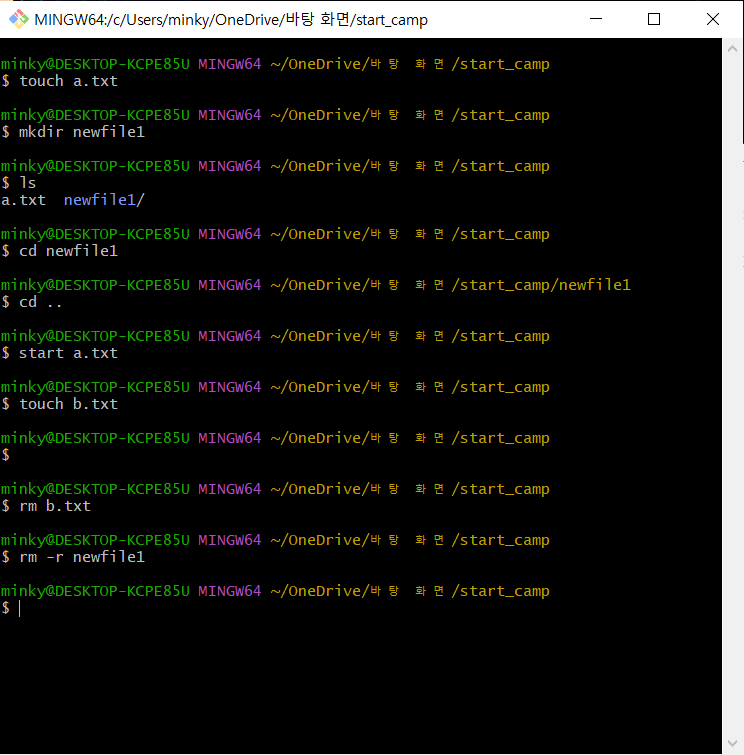

# CLI(Command Line Interface)

## CLI : 명령어를 통해 사용자와 컴퓨터가 상호 작용하는 방식

[CLI.md](https://s3-us-west-2.amazonaws.com/secure.notion-static.com/212a0ebe-94b9-40fb-9862-ba6c207a3f22/CLI.md)

### CLI vs GUI

GUI(Graphic User Interface) : 그래픽을 통해 사용자와 컴퓨터가 상호 작용하는 방식

1. CLI의 장점
  - 수 많은 서버 / 개발 시스템이 CLI를 통한 조작 환경 제공
  - CLI의 핵심 : 내가 어디 있는지(경로)를 알아야 한다!

2. CLI의 문법 활용

- CLI에서 dot의 역할
  - . : 현재 디렉토리
  - .. : 현재의 상위 디렉토리(부모 폴더)
- touch :  파일 생성
- mkdir : 새 디렉토리 생성
- ls : 현재 작업 중인 디렉토리 내부 폴더/파일 목록 출력
- cd : 현재 작업 중인 디렉토리 변경(위치 이동)
- start : 폴더/파일 열기(** Mac에서는 open을 사용)
- rm : 파일 삭제
    - 디렉토리를 삭제할 경우는 rm -r 문법 사용
- CLI 경로 확인
    - 절대 경로 : Root 디렉토리부터 목적 지점까지 거치는 모든 경로 작성
    - 상대 경로 : 현재 작업하고 있는 디렉토리 기준 상대적인 경로 작성