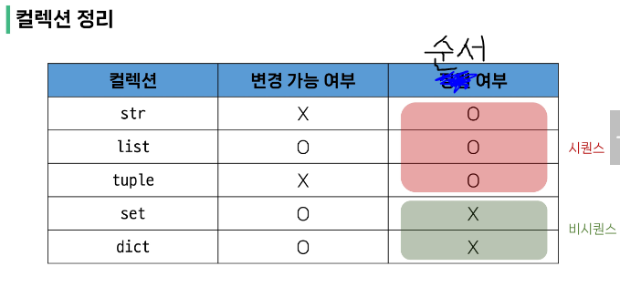
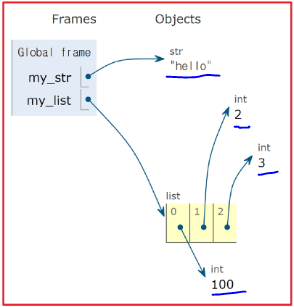
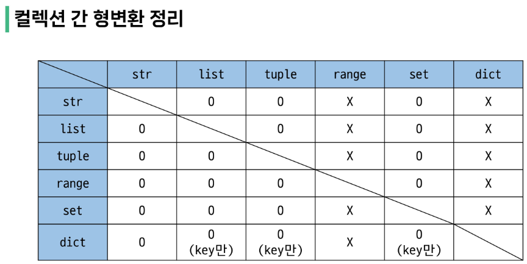
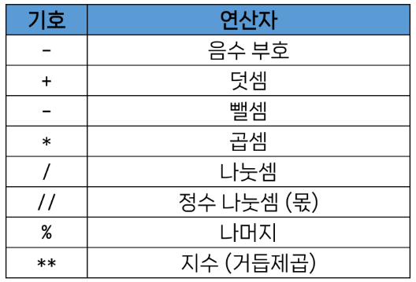
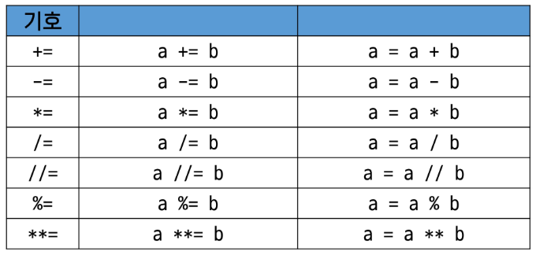
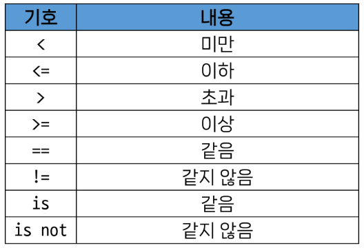
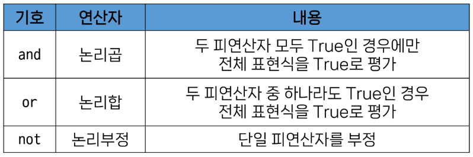
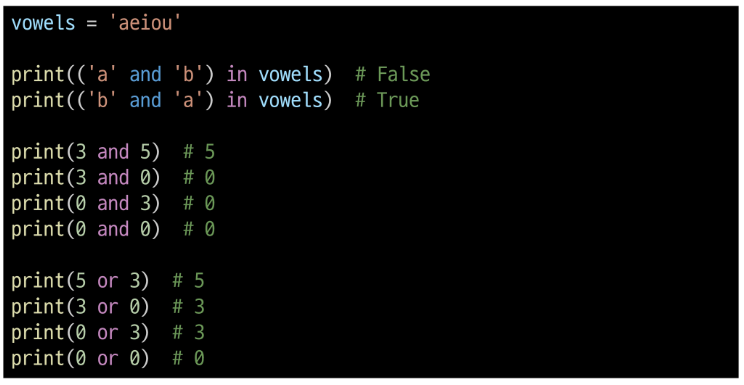
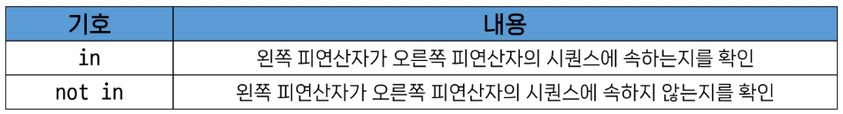
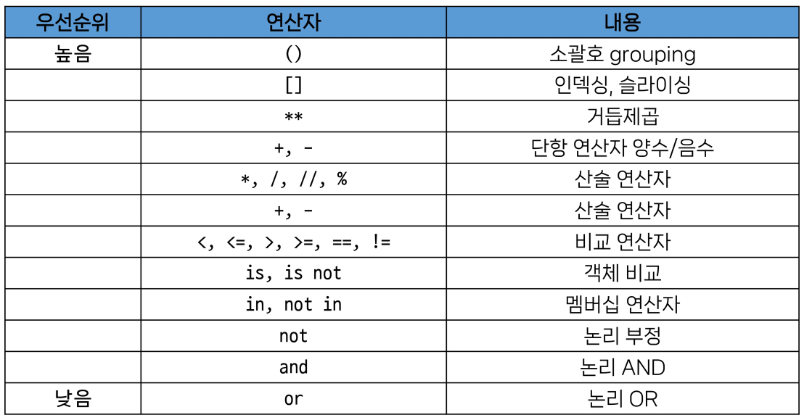

# 파이썬_02 
# Data Types

## **[INDEX]**

  ### 1. Data Types
  - 데이터 타입 분류
  - 데이터 타입이 필요한 이유
  ### 2. Numeric Types
  - int
  - float
  ### 3. Sequence Type
  - Sequence Type의 특징
  - Sequence Type의 종류
  - str
  - index
    - indexing & slicing
  - list
  - tuple
  - range
  ### 4. Non - sequence Types
  - dict
  - set
  ### 5. Other Types
  - None
  - Boolean
  ### 6. Collection
  - 컬렉션 정리
  - 불변과 가변의 차이
  ### 7. Type Conversion
- 암시적 형 변환(Implicit Type Conversation)
- 명시적 형 변환(Explicit Type Conversation)
### 8. Operator
- 연산자의 종류
- 산술 연산자
- 복합 연산자
- 비교 연산자
- 논리 연산자
- 멤버십 연산자
- 시퀸스형 연산자
- 연산자 우선순위
### 9. 새로 배운 것
  ---

## 1. Data Types
데이터 타입 : 값의 종류와 그 값에 적용 가능한 연산과 동작을 결정하는 속성???
- data type에 따라 사용할 수 있는 연산과 동작의 종류가 달라진다!
### 데이터 타입 분류
- Numeric types : int, float, complex
- Text Sequence type : 

### 데이터 타입이 필요한 이유
- 값들을 구분하고, 어떻게 다뤄야 하는 지 알 수 있음
- 각 데이터 타입 값마다 적합한 도구가 있음
- 타입을 명시적으로 지정할 경우, 코드를 읽는 사람이 변수의 의도를 더 쉽게 이해 가능 / 잘못된 데이터 타입으로 인한 오류 예방
  
## 2. Numeric Types(수치형 data types)
### int(정수형) : 정수를 표현하는 자료형
<진수의 표현>
- 2진수(binary) : 0b
  - ex. print(0b10)
- 8진수(octol) : 0o
  - ex. print(0o30) : 24
- 16진수(hexadecimal) : 0x
  - ex. print(0x10) : 16 

<진법의 변경 함수>
- 10진수 -> 2진수
print(bin(12)) -> 0b1100
- 10진수 -> 8진수
print(oct(12)) -> 0o14
- 10진수 -> 16진수
print(hex(34)) -> 0x22

### float(실수형) : 실수를 표현하는 자료형
- 프로그래밍 언어에서 float는 실수에 대한 근삿값이다(정확한 값이 아닐수도)

유한 정밀도 : 컴퓨터 메모리 용량은 한정적이고, 한 숫자에 대해 저장하는 용량이 제한되어있는 상황에서 가장 가까운 값을 출력해주는 것(최대 소수 16자리까지)
- print(2/3) = 0.6666666666666666
- print(5/3) = 1.6666666666666667

<실수 연산 시 주의사항> - Floating point rounding error
- 컴퓨터는 2진수를 사용하고, 사람은 10진법을 사용한다.
- -> 10진수의 0.1 == 2진수의 0.000110011001100110011.......
- -> 10진법의 근사값만 표시한다 -> 이로부터 발생하는 에러 조심

<실수 연산 문제 해결책>
1. 두 수의 차이가 매우 작은 수보다 작은지 확인
a = 3.2 - 3.1 = 0.1000000000000009, b = 1.2 - 1.1 = 0.0999999999999987
- -> print(abs(a - b) < 1e-10)이 True일 경우
2. math 모듈의 isclose() 메소드 사용
- import math
- print(math.isclose(a, b))가 True일 경우

지수 표현 방식 : Xe-n == X * (10**-n)
- number = 314e-2 : number = 314 * 0.01
- 지수 표현 방식을 사용할 경우, float형이 됨(314e2 = 31400.0)
  
## 3. Sequence Type
Sequence Type : 여러 개의 값들을 순서대로 나열하여 저장하는 자료형

### Sequence type의 종류
- str, list, tuple, range

### Sequence type의 특징
1. 순서(Sequence) : 값들이 순서대로 저장한다(정렬의 개념은 XXXX).
2. 인덱싱(Indexing) : 각 값에 고유한 번호(index)를 가지고 있으며, 인덱스를 사용하여 특정 위치의 값을 선택(접근)할 수 있다.
  - index : 시퀀스 내의 값들에 대한 고유한 번호. 각 값의 위치 식별에 사용하는 숫자
    - 0 ~ (len - 1) or -len ~ -1로 사용 가능
3. 슬라이싱(Slicing) : 인덱스 범위를 조절해 부분적인 값을 추출할 수 있다.
  - 시퀀스의 일부분을 선택하여 추출하는 작업 
  - 시작 인덱스와 끝 인덱스를 지정하여 해당 범위의 값을 포함하는 새로운 시퀀스를 생성
  - seq[i:j:k] : i번 index ~ (j-1)번 index를 k-step만큼 점프하며 추출
    - k 생략시 그냥 k = 1 / i 또는 j 생략시 처음 or 끝을 의미
    - k가 음수일 경우, 뒤에서부터 슬라이싱
4. 길이(Length) : len() 함수를 사용하여 저장된 값의 개수(길이)를 구할 수 있다.
5. 반복(Iteration) : 반복문을 사용하여 저장된 값들을 반복적으로 처리할 수 있다.
   
### str(문자열) : 문자들의 순서가 있는 변경 불가능한 시퀸스 자료형
문자열 표현
- 문자열은 단일 문자나 여러 문자의 조합으로 이루어져 있다.
- 작은 따옴표(') 또는 큰따옴표(")로 감싸서 표현한다(하나를 끝까지 쓰는게 나음).
- 중첩 따옴표 : 문자열 안에 ' 혹은 "를 사용하는 경우이다.
  - 문자열 전체를 덮는 따옴표와 다른 따옴표를 사용
  - 역슬래쉬(backslash)를 사용
<Escape Sequence>
- 역슬래쉬(\) 뒤에 특정 문자가 와서 특수한 기능을 하는 문자 조합
  - \n : 줄 바꿈
  - \t : 탭만큼 들여쓰기
  - \\ : 백슬래쉬
  - \' : 작은 따옴표
  - \" : 큰 따옴표

String Interpolation : 문자열 내에 변수나 표현식을 삽입하는 방법
- print(f'{변수/표현식}') 처럼 f 또는 F 접두어를 붙이고, 표현식을 {}내에 작성하여 문자열에 파이썬 표현식을 삽입할 수 있다.(가장 편한 거임 이게)
  
- print('{}'.format(변수/표현식)) 처럼 .format() 접미어를 붙이고, 표현식을 {}내에 작성하여 문자열에 파이썬 표현식을 삽입할 수 있다.

- print('%s %d %f' %())는 너무 예전거고, 너무 어렵다.

<f-string 응용> - f-string advanced 검색
1. print(f'{변수:>n}') :  n칸 차지, 변수는 오른쪽에서 출력
2. print(f'{변수:^n}') :  n칸 차지, 변수는 가운데 정렬
3. print(f'{변수:.nf}') : 소수점 n번째 자리까지 변수 표현
   
문자열 시퀀스의 특징
- 인덱싱 : str[i] : i번 index에 접근 
- 슬라이싱 : str[i:j] : i번 index ~ (j-1)번 index까지 슬라이싱
- 길이 : len(str) : str형의 길이(요소의 개수) 반환
- 불변 : 문자열은 요소를 수정할 수 없다!!!!
  - TypeError : 'str' object does not support item assignment
  - 수정하는 것이 아닌, 새로운 문자열을 생성하여 약간의 조건을 붙여 새로 생성하면 됨

### list(리스트) : 여러 개의 값을 순서대로 저장하는 변경 가능한 시퀀스 자료형
리스트 표현
- 0개 이상의 객체를 포함하며 데이터 목록을 저장한다.
- 대괄호([])로 표기한다.
- 데이터는 어떤 자료형도 저장할 수 있다.

리스트 시퀀스의 특징
- 인덱싱 : list[i] : i번 index에 접근
  - 중첩 리스트 접근 : 리스트 안에 시퀀스 요소가 i번 index에 존재할 경우
    - list[i][a] : 시퀀스 요소인 i번 index에 접근 -> 그 요소의 a번 index에 접근
- 슬라이싱 : list[i:j:k]
- 길이 : len(list)
- 가변 : 특정 요소/범위에 접근해서 수정 가능
  
### tuple(튜플) : 여러 개의 값을 순서대로 저장하는 변경 불가능한 시퀀스 자료형
튜플 표현
- 0개 이상의 객체를 포함하며 데이터 목록을 저장한다.
- 소괄호(())로 표기한다.
  - 요소가 한 개일 경우, (a,)와 같이 뒤에 반점(,)을 붙여줘야 한다!!(안그러면 걍 a의 data type으로 바뀜)
  - 소괄호를 사용하지 않아도, 내부 작성만 같이 할 경우 tuple형으로 인식한다
- 데이터는 어떤 자료형도 저장할 수 있다.

튜플 시퀀스의 특징
- 인덱싱
- 슬라이싱
- 길이
- 불변 
  - TypeError : 'tuple' object does not support item assignment

튜플의 사용 목적
- 튜플은 불변 : 안전하게 여러 개의 값을 전단, 그룹호, 다중 할당 등 개발자가 직접 사용하기보다 파이썬 내부 동작에서 주로 사용됨

### range() : 연속된 정수 시퀀스를 생성하는 변경 불가능한 자료형
range 표현
- range(n) : 0 ~ (n-1)까지의 숫자의 시퀀스
- range(n, m) : n ~ (m-1)까지의 숫자 시퀀스
- 주로 반복문과 함께 사용
  - 그대로 출력할 경우, 그냥 range형으로 나옴 -> list로 형 변환시 데이터 확인 가능

## 4. Non - sequence Types
### dict(딕셔너리) : key와  value의 쌍으로 이루어진 순서와 중복이 없는 변경 가능한 자료형 
딕셔너리 표현
- key : 변경 불가능한 자료형만 사용(str, int, float, tuple, range, ...)
- value : 모든 자료형 사용 가능
- 중괄호({})로 표기
  - 중괄호 내에 :를 이용하여 key와 value 구분 / ,를 이용하여 key-value쌍을 구분

딕셔너리 사용법 : key를 통해 value에 접근
- dict[key] -> 해당 key에 대응하는 value 반환

### set(세트) : 순서와 중복이 없는 변경 가능한 자료형
세트 표현 
- 수학에서의 집합과 동일한 연산 처리 가능
- 중괄호({})로 표기
  - 빈 집합을 표시할 때 {}가 아닌(dict이랑 겹쳐서) set()라는 함수 사용 
- 중복 요소는 알아서 하나만 남겨줌({1, 1, 1} == {1})

세트 연산
- 합집합 : set_1 | set_2 == set_1과 set_2의 합집합
- 교집합 : set_1 & set_2 == set_1과 set_2의 교집합
- 차집합 : set_1 - set_2 == set_1과 set_2의 차집합

## 5. Other Types
### None : 파이썬에서 '값이 없음'을 표현하는 자료형
- 엄연히 0과는 다르다!!(0은 0이라는 값이 있잖아용)

### Boolean : True와 False를 표현하는 자료형
불린 표현
- 비교/논리 연산의 평가 결과로 사용
- 조건/반복문과 함께 사용

## 6. Collection 
### Collection : 여러 개의 항목 또는 요소를 담는 자료 구조
collection의 종류 : str, list, tuple, set, dict
- range는 걍 문서별로 차이가 있는듯?

### +++ 불변과 가변의 차이 +++
**왜 str는 불변 시퀀스, list는 가변 시퀀스인가?**
불변형과 가변형의 차이

- 메모리주소 복사 
- lst1 = [1, 2, 3]
- lst2 = lst1
- lst1[0] = 100
- print(lst1) # 100
- print(lst2) # 100

- x = 10
- y = x
- x = 20
- print(x)
- print(y)

str과 list를 생성할 때의 내부적인 동작

list : 객체들의 '참조'들을 모아놓은 collection
  - 수정시 바라보는 방향만 바꿔주면 됨

## 7. Type Conversation
### 암시적 형 변환(Implicit Type conversation)
암시적 형 변환 : 파이썬이 자동으로 형 변환 하는 것
- Bool, Num Type에서만 가능
  - ex. 3 + 5.0 -> 3.0 + 5.0 == 8.0(int -> float)
  - ex. True + 3 -> 1 + 3 == 4(bool -> int)
  - ex. True + False -> 1 + 0 == 1(bool -> int)
  
### 명시적 형 변환(Explicit Type conversation)
명시적 형 변환 : 개발자가 직접 형 변환을 하는 것(Not implicit T.C)
- str -> int : int 문법 형식에 맞는 숫자만 가능
- int -> str : 모든 case 가능
- dict -> list : key만 추출하여 리스트의 요소화

등등

## 8. Operator
### 산술 연산자

## 복합 연산자 : 연산과 할당이 함께 이뤄짐

- 반복문에서 많이 사용(변수 업데이트)
  
## 비교 연산자 

  ## is 비교 연산자 : 메모리 내에서 같은 객체를 참조하는지(객체의 주소) 확인
  식별성(identity)을 파악하는 연산자
  - 값을 비교하는, 즉 동등성(equality)를 파악하는 == 연산자와 다름

  ex. 
  - 2.0 == 2는 True(값이 같으니)
  - 2.0 is 2는 False(주소가 다르니)

## 논리 연산자

- 비교 연산자와 함께 사용 가능

  ## 단축평가 : 논리 연산에서 두 번째 피연산자를 평가하지 않고 결과를 결정하는 동작
  - 평가와 상관없이 결과가 정해질 때
  <단축평가 동작>
  
  이거 꼭 혼자 작성해보기. 그리고 출력결과의 이유를 찾아보기
  - and
    - 첫 번째 피연산자가 False인 경우, 전체 표현식은 False(두 번째 피연산자 평가 X)
    - 첫 번째 피연산자가 True인 경우, 전체 표현식의 결과는 두번째 피연산자에 의해 결정(전체 결과값 == 두 번째 결과값)
  - or 
    - 첫 번째 피연산자가 True인 경우, 전체 표현식은 True(두 번째 피연산자 평가 X)
    - 첫 번째 피연산자가 False인 경우, 전체 표현식의 결과는 두 번째 피연산자에 의해 결정(전체  결과값 == 두 번째 결과값)
  
  단축평가의 장점 : 코드 실행 최적화, 불필요한 연산 감소
    - 첫 번째 피연산자가 False인 경우, 두 번째 피연산자까지 확인

## 멤버십 연산자 : 특정 값이 시퀀스나 다른 컬렉션에 속하는지 여부 확인

## 시퀀스형 연산자(+, *) : 산술 연산자와 다른 역할을 가진 연산자
- 합 연산(+) : 두 시퀀스를 연결시켜주는 연산자
- 곱 연산(*) : 시퀀스를 정해진 연산의 수 만큼 반복해주는 연산자

### 연산자 우선순위

## 9. 새로 배운 것

1. 데이터 타입의 필요성
- 값들의 구분 및 해당 데이터타입에 적합한 도구 사용
- 코드를 읽는 사람 입장에서 더 빠르고 쉽게 의도를 파악 가능
- 잘못된 데이터 타입으로 발생할 수 있는 오류 예방 가능

2. 진수를 프로그램에서 표현하는 법
- 2진수(0b), 8진수(0o), 16진수(0x)
- 반대로 2진수로 표현(bin()), 8진수로 표현(oct()), 16진수로 표현(hex())

3. 유한 정밀도
- 컴퓨터의 메모리 용량의 한계로 인해 발생하는 소수점 오류를 최대한 줄이는 것
- Floating point rounding error : 2진수를 사용하는 컴퓨터 vs 10진수를 사용하는 사람 사이에서 발생하는 소수점 오류
  - abs(person-computer) < 1e-10 == True
  - import math -> math(isclose()) == True
 
4. Sequence Type의 여러가지 특징
- 순서가 있음 -> 인덱스를 부여함
자료형을 구분할 때 세 가지 기준으로 나눌 수 있다!
- seq or non-seq?(순서가 있나요?)
- mutable or immutable?(반복 가능한가요?)
- changable or not changable?(변경 가능한가요?)

5. 불변(str)과 가변(list)의 차이는 무엇일까? - 값의 주소 할당에 담겨있다!
두 가지 예시를 통해 확인
  1. list
  - list1 = [1, 2, 3] # list1이라는 변수에 리스트값을 담은 주소를 할당
  - list2 = list1 # list2라는 변수에 list1에 담겨있는 값의 주소를 할당
    - 즉, list2는 list1이 보고 있는 주소를 보고있다.
  - list1[0] = 100 # list1의 0번 index를 변경(요소 변경이고, 주소는 변함없음)
  - print(list1 == list2) # True : 같은 주소를 바라보고 있어서
  2. str
  - str1 = 'hi' # str1이라는 변수에 문자열을 담은 주소 할당
  - str2 = str1 # str2라는 변수에 str1에 담겨있는 값의 주소 할당
  - str1 = 'hello' # str1이라는 변수에 새로운 문자열이 담겨있는 새로운 주소 할당
  - print(str1 == str2) # False : 서로 같은 주소를 바라보고 있지 않아서

6. 단축평가(오늘의 핵심인듯)
- 논리연산 과정에서 메모리 효율성을 위해 이미 결과가 정해지면 뒤의 평가와 상관없이 결과를 결정할 때
- 두 가지 예시를 통해 파악하기
  - print(('a' and 'b') in 'akleo')
    - 'a'는 True -> 'b'는 True ---> ('a' and 'b')의 결과는 'b'(뒤의 값에 대해서도 평가를 진행했기 때문에)
    - 결국, 위의 출력문은 print('b' in 'aklea') 가 된다!!!
    - 따라서, 정답은, 'b'는 'akleo'라는 str에 들어있지 않아서 False
  - 반대로 쓸 경우, print('a' in 'aklea') -> True
단축평가 과정은 논리연산이 나올 때 반드시 생각해야 할듯

